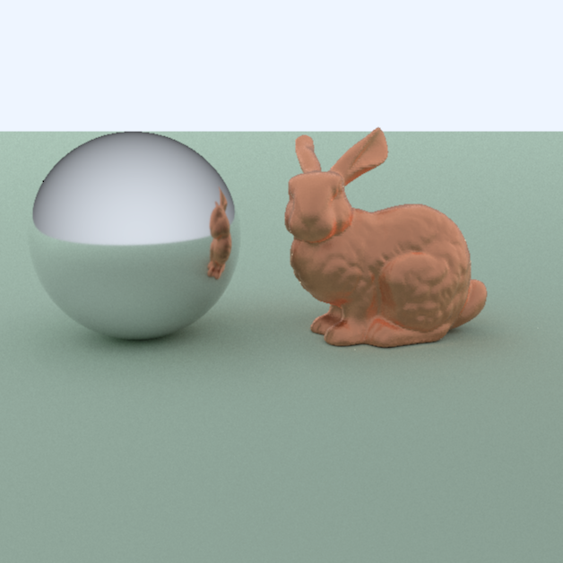

# Assignment10 - Create Your Own Assignment

## Proposal

In this assignment, I'll try to introduce some modern rendering technical flavor to the raytracer. Considering this MIT6.837 is a 2003 course, when common techniques like PBR, path tracing were far less popular than today, it could be AWESOME to implement some of them in this raytracer while keeping the overall structure.

## Features

- [x] Path tracing
  - [x] NEE(Next Event Estimation)
  - [x] BRDF Importance Sampling
- [x] PBR materials
  - [x] Disney Principled BRDF(simpified, without clearcoat and sheen)
- [ ] Realistic camera
  - [ ] Depth of Field
- [x] Parallel rendering(using [oneTBB](https://github.com/oneapi-src/oneTBB))

## Showcase

perfect mirror sphere and glossy bunny

## References

- [Physically Based Rendering: From Theory to Implementation](http://www.pbr-book.org/)
- [Disney Principled BRDF实现笔记](https://airguanz.github.io/2019/02/20/disney-brdf.html)
